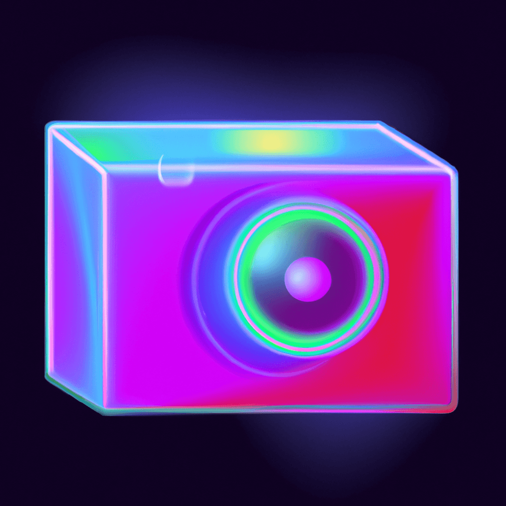

<p align="center">

</p>
<h1 align="center">
  <a href="https://mocksocial.devrokas.com/"> MockSocial | Generate fake screenshots of social media posts</a>
</h1>

<p align="center"> 
  <a href="https://mocksocial.devrokas.com/"><b>https://mocksocial.devrokas.com/</b></a>
</p>


<p align="center">

  
  
  <a href="https://github.com/fraxxio/DishRecipesApp.git">
    
  </a>
    
  

  <a href="https://github.com/fraxxio/">
    
  </a>
</p>

<p align="center">
 <a href="#about">About</a> •
 <a href="#features">Features</a> •
 <a href="#tech-stack">Tech Stack</a> •  
 <a href="#license">License</a>
</p>

## About

MockSocial - Generate realistic fake social media post or message screenshots for Twitter, Instagram, Facebook, Discord, and ChatGPT. Customize usernames, text, profile pictures, posts, reactions, badges, and themes effortlessly.

---

## Features

- [x] You can choose from 6 different social media platforms: Twitter, Instagram, Facebook, Discord, ChatGPT.
- [x] Ability to add custom values to the image:
  - [x] Username.
  - [x] Post text, or message text.
  - [x] Profile picture.
  - [x] Post picture.
  - [x] Reaction emoji.
  - [x] User badge selection.
  - [x] Theme selection. 

---
## Tech Stack

The following tools were used in the construction of the project:

#### **Platform** [Next Js](https://nextjs.org/)

- **[Uploadthing](https://uploadthing.com/)**
- **[shadcn](https://ui.shadcn.com/)**
- **[Tailwind CSS](https://tailwindcss.com/)**
- **[Lucide Icons](https://lucide.dev/icons/)**
- **[Zod](https://zod.dev/)**

> See the file [package.json](https://github.com/fraxxio/MockSocial/blob/main/package.json)
---

### Pre-requisites

Before you begin, you will need to have the following tools installed on your machine:

- [Git](https://git-scm.com),
- [Node.js](https://nodejs.org/en/),
- [Npm](https://www.npmjs.com/).

#### Running the web application

```bash

# Clone this repository
$ git clone https://github.com/fraxxio/MockSocial.git

# Access the project folder in your terminal
$ cd MockSocial

# Install the dependencies
$ npm install

# Run the application in development mode
$ npm run dev

# The application will open on the port: 3000 - go to http://localhost:3000

```

---

## License

This project is under the MIT license.
